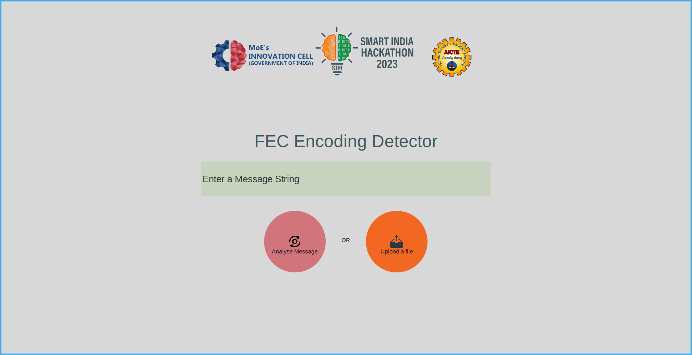

# Blind FEC Decoder

## Problem Statement

This is the project our team "Daemons" made during the Grand Finale of Smart India Hackathon 2023. 

We were asked to identify and extract Forward Error Correction(FEC) schemes from unknown demodulated signals. 

## Description

FEC is an error correction mechanism with certain trade off in Communication. This is a very critical parameter in order to extract output from a demodulated data. Identification and extraction of Forward Error Correction schemes of unknown satellite signals using MATLAB/Python is desired for further processing. The objective of the problem is to develop a tool / mechanism for detection / extraction of Forward Error Correction (FEC) schemes of unknown demodulated signals. The developer may use open source signal for design of their tool. Evaluation shall be based on correct detect / extraction of FEC for given signal.

### This project consists of three parts
- A lightweight and fast GUI written with python and Qt frameworks for easy implementation in various devices such as embedded devices or low-resource machines. [see root folder]
- A Jupyter Notebook is provided to demostrate and visualise the waveform after the channel coding is applied on the generated string. [see dataVisulationApplication/]
- A minimal and easy to implement streaming data script written in python to simulate real world signal interception. [see StreamingDataScript/]

### This application is

- 98% accurate in case of BPSK modulated signals(max. string length 2048)
- [WIP] 71% accurate in case of QPSK modulated signals(max. string length 2048)
- [WIP] 63% accurate in case of 8-PSK modulated signals(max. string length 2048)
- Optimized for embedded devices
- Supports file as well as manual text input
- Supports real time detection on stream of data

# Different components

### Data Generation

- 5 types of FEC encoding techniques with 3 different types of modulation techniques are used. Namely,
    - FEC schemes:
        - Turbo code encoding
        - Low Density Parity Check encoding
        - Convolutional code encoding
        - Bose–Chaudhuri–Hocquenghem encoding
        - Turbo Product code encoding
    - Modulation techniques:
        - BPSK modulation
        - QPSK modulation
        - 8-PSK modulation
- Usage of variable code rates to make the data as close to the real world demodulated signals as possible.
- average SNR value 10 is used for generating data.

### FEC Scheme Classification

- usage of improved Recurrent Neural Network model for classifying the aforementioned 5 FEC coding techniques.
- trained on 4Lacs of data varying in length from 1024 to 2048.
- trained to 2 x T4 GPUs parallely.
- both the trained model and their weights are saved seperately for **fast real-time** classification
- easily customisable backend as the model weights are already saved.

## Dependencies

- **Data Generation**
    - [Sionna](https://github.com/NVlabs/sionna) for applying encoding schemes
    - [CommPy](https://github.com/veeresht/CommPy) for simulating noise channel and modulation
    - [Pandas](https://github.com/pandas-dev/pandas) for manipulating and creating CSV datasets
    - [NumPy](https://github.com/numpy/numpy) for performing vector and linear algebra operations
- **Classification**
    - [Numpy](https://github.com/numpy/numpy) for performing vector and linear algebra operations
    - [Pandas](https://github.com/pandas-dev/pandas) for reading and manipulating datasets
    - [Matplotlib](https://github.com/matplotlib/matplotlib) for plotting graphs based on datas
    - [Tensorflow](https://github.com/tensorflow/tensorflow) for creating the RNN model used for classification
    - [Keras](https://github.com/keras-team/keras) for creating the layers and for the model save/load operations
